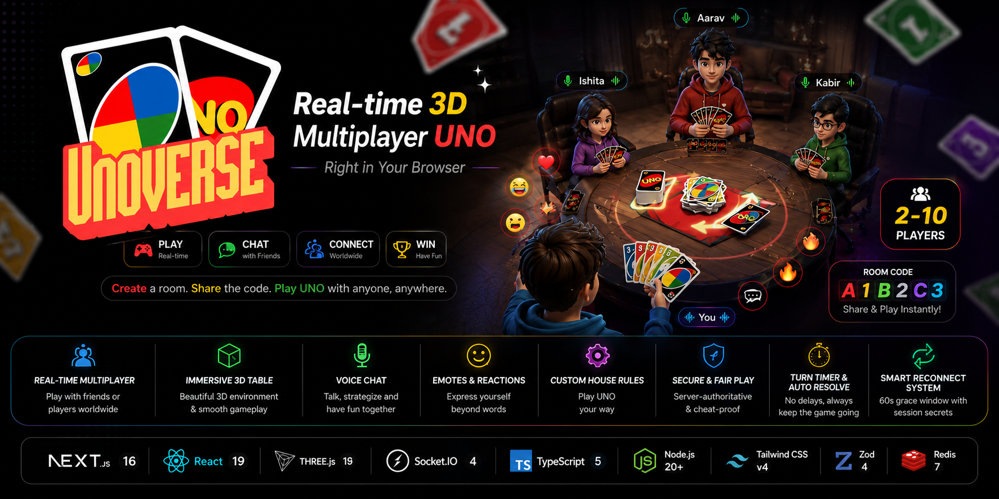

<div align="center">



# UNOVERSE

### **Real-time 3D Multiplayer UNO — Right in Your Browser**

[](https://nextjs.org/)
[](https://react.dev/)
[](https://threejs.org/)
[](https://socket.io/)
[](https://typescriptlang.org/)
[](https://nodejs.org/)

**Create a room. Share the code. Play UNO with anyone, anywhere.**

[Getting Started](#-getting-started) · [Features](#-features) · [Architecture](#-architecture) · [House Rules](#-house-rules) · [Deployment](#-deployment)

</div>

---

## ✨ Features

<table>
<tr>
<td width="50%">

### 🎮 Gameplay
- **Full UNO rules engine** — server-authoritative, cheat-proof
- **2–10 player** rooms with real-time state sync
- **20+ configurable house rules** (Jump-In, Seven-O, Stacking, and more)
- **UNO call system** — manual or auto-declare modes
- **Wild Draw Four challenges** with bluff detection
- **Turn timer** with auto-resolve on timeout
- **Spectator mode** — watch live games without a seat

</td>
<td width="50%">

### 🌐 Multiplayer & Social
- **Instant room creation** with shareable 6-character codes
- **Invitation links** — one click to join via URL
- **Real-time text chat** with grouped messages and avatars
- **Emoji reactions** visible to the whole table
- **WebRTC voice chat** — talk hands-free, peer-to-peer
- **Reconnection support** — 60s grace window with session secrets

</td>
</tr>
<tr>
<td width="50%">

### 🎨 3D Experience
- **Interactive 3D table** powered by React Three Fiber
- **Cinematic card animations** — draws, plays, and shuffles
- **Dynamic 3D action effects** for Skips, Reverses, and Draw cards
- **Animated player seats** and glowing turn indicators
- **Immersive room environment** with arcade-style aesthetics

</td>
<td width="50%">

### ⚡ Technical
- **Server-authoritative** — all game logic validated server-side
- **Per-player state sanitization** — you only see your own hand
- **Zod validation** on every socket event
- **Redis-backed** persistence & pub/sub for production scaling
- **Docker Compose** for one-command local deployment
- **Comprehensive test suite** with Vitest

</td>
</tr>
</table>

---

## 🏗 Architecture

```
                    ┌─────────────────────────────────────────────┐
                    │              Browser (Client)               │
                    │                                             │
                    │   Next.js 16 ─── React 19 ─── Zustand       │
                    │       │              │                      │
                    │   R3F/drei      Framer Motion               │
                    │   (3D Table)    (UI Animations)             │
                    └──────┬──────────────┬───────────────────────┘
                           │              │
                    HTTPS (SSR)    WSS (Socket.IO)    WebRTC (Voice)
                           │              │                │
                    ┌──────▼──────────────▼────────┐       │
                    │        Backend Server        │       │
                    │                              │       │
                    │   Express 4 ── Socket.IO 4   │   P2P via STUN
                    │        │                     │       │
                    │   UNO Rules Engine           │       │
                    │   ├── actions.ts (moves)     │       │
                    │   ├── rules.ts (validation)  │       │
                    │   ├── houseRules.ts (config) │       │
                    │   ├── deck.ts (cards)        │       │
                    │   └── scoring.ts             │       │
                    │        │                     │       │
                    │   Room Manager               │       │
                    └────────┬─────────────────────┘       │
                             │                             │
                    ┌────────▼─────────┐                   │
                    │   Redis 7        │         Browser ◄─┘
                    │ (State + Pub/Sub)│
                    └──────────────────┘
```

### Tech Stack

| Layer | Technologies |
|:------|:-------------|
| **Frontend** | Next.js 16 (App Router), React 19, React Three Fiber, drei, Tailwind CSS v4, Zustand, Framer Motion, Lucide Icons |
| **Backend** | Node.js 20+, Express 4, Socket.IO 4, TypeScript 5, Zod 4 |
| **Realtime** | Socket.IO (game state + chat) • WebRTC (peer-to-peer voice, STUN) |
| **Data** | Redis 7 (persistence + Socket.IO adapter) • In-memory (dev) |
| **DevOps** | Docker Compose • Vercel (frontend) • Railway / Render (backend) |

---

## 🚀 Getting Started

### Prerequisites

- **Node.js 20+** (uses `process.loadEnvFile`)
- **npm** (included with Node)
- Redis *(optional — only needed for production persistence)*

### 1. Clone & Install

```bash
git clone https://github.com/tanmay-tiwari-20/unoverse.git
cd unoverse
```

### 2. Start the Backend

```bash
cd backend
npm install
cp .env.example .env          # adjust PORT / CORS_ORIGIN if needed
npm run dev                   # http://localhost:3001
```

### 3. Start the Frontend

```bash
cd frontend
npm install
cp .env.example .env.local     # set NEXT_PUBLIC_BACKEND_URL
npm run dev                    # http://localhost:3000
```

### 4. Play!

Open [http://localhost:3000](http://localhost:3000), enter your name, and **Create** a room.
Share the 6-character code (or the invite link) with friends to **Join**.

> [!TIP]
> You can also use Docker Compose for a production-like setup with Redis:
> ```bash
> docker compose up --build
> ```

---

## 🃏 House Rules

The host can customize gameplay before starting. All rules are **server-enforced**.

<details>
<summary><b>🔀 Play & Flow</b></summary>

| Rule | Description |
|:-----|:------------|
| **Jump-In** | Play an identical card out of turn to "jump in" |
| **Seven Swap** | Playing a 7 swaps your hand with a chosen opponent |
| **Zero Rotate** | Playing a 0 rotates all hands one seat forward |
| **Draw Then Play** | After drawing, optionally play the drawn card |
| **Force Play Drawn** | The drawn card *must* be played if it's playable |
| **Draw Until Playable** | Keep drawing until a playable card appears |
| **Must Play If Playable** | Cannot draw while holding a playable card |

</details>

<details>
<summary><b>📚 Stacking</b></summary>

| Rule | Description |
|:-----|:------------|
| **Stacking** | Chain +2 / +4 cards instead of resolving immediately |
| **Stack +2 on +4** | Allow a +2 to be stacked onto a +4 chain |
| **Stack to Eat** | Breaking a chain draws the *full* accumulated total |

</details>

<details>
<summary><b>🛡 Challenges & UNO</b></summary>

| Rule | Description |
|:-----|:------------|
| **Challenge Wild +4** | Targeted player may challenge a +4 |
| **Bluffing +4** | +4 is illegal if you held a matching color card |
| **Must Say UNO** | Declare UNO on your second-to-last card or get penalized |
| **UNO Call Mode** | `manual` (press button) or `auto` (server handles it) |
| **Allow Late UNO** | Declaring UNO late (before next player acts) still counts |

</details>

<details>
<summary><b>🏆 Winning Restrictions</b></summary>

| Rule | Description |
|:-----|:------------|
| **Win with Wild** | Allow Wild / Wild +4 as your last card |
| **Win with Draw Card** | Allow +2 / +4 as your last card |
| **Win with Action Card** | Allow Skip / Reverse as your last card |
| **Number Card Finish Only** | *Only* number cards can be your final play |

</details>

---

## 📁 Project Structure

```
unoverse/
├── backend/                    # Express + Socket.IO server
│   ├── src/
│   │   ├── index.ts            # Server entry — Express, Socket.IO, event handlers
│   │   ├── game/
│   │   │   ├── actions.ts      # Move execution (play, draw, UNO call, challenge)
│   │   │   ├── rules.ts        # Move validation & legality checks
│   │   │   ├── houseRules.ts   # 20+ configurable rules with dependency graph
│   │   │   ├── deck.ts         # Card deck creation & shuffling
│   │   │   ├── gameState.ts    # Game state initialization
│   │   │   ├── scoring.ts      # End-of-round point calculation
│   │   │   └── turnManager.ts  # Turn rotation & skip logic
│   │   ├── rooms/              # Room lifecycle management
│   │   ├── validation/         # Zod schemas for socket events
│   │   └── test/               # Vitest test suites
│   ├── Dockerfile
│   └── package.json
│
├── frontend/                   # Next.js app
│   ├── src/
│   │   ├── app/
│   │   │   ├── page.tsx        # Landing page (create / join room)
│   │   │   └── lobby/          # Pre-game lobby with settings
│   │   ├── components/
│   │   │   ├── table/          # 3D table, cards, seats, effects
│   │   │   ├── cards/          # Card rendering & hand HUD
│   │   │   ├── social/         # Chat panel, emoji reactions
│   │   │   ├── landing/        # 3D landing scene
│   │   │   └── ui/             # Settings, help modals, HUD elements
│   │   ├── hooks/              # useSocket, useVoiceChat, useViewport
│   │   ├── store/              # Zustand game state store
│   │   └── types/              # Shared TypeScript types
│   └── package.json
│
├── docker-compose.yml          # Full-stack local deployment
├── DEPLOY.md                   # Production deployment guide
└── README.md
```

---

## ⚙️ Environment Variables

### Backend (`backend/.env`)

| Variable | Default | Description |
|:---------|:--------|:------------|
| `PORT` | `3001` | HTTP + Socket.IO listen port |
| `CORS_ORIGIN` | `*` | Allowed browser origins (comma-separated). Lock down in production. |
| `STORE` | `memory` | Storage backend: `memory`, `file`, or `redis` |
| `REDIS_URL` | — | Redis connection string (required when `STORE=redis`) |
| `TURN_TIMEOUT_MS` | `45000` | Turn auto-resolve deadline (ms) |

### Frontend (`frontend/.env.local`)

| Variable | Default | Description |
|:---------|:--------|:------------|
| `NEXT_PUBLIC_BACKEND_URL` | `http://localhost:3001` | Backend URL reachable from the browser |

---

## 🧪 Testing

```bash
# Run the full test suite
cd backend
npm test

# Watch mode during development
npm run test:watch

# Run a standalone game simulation (exercises the full rules engine)
npm run sim
```

---

## 🧾 Scripts

<table>
<tr>
<th>Backend</th>
<th>Frontend</th>
</tr>
<tr>
<td>

| Command | Description |
|:--------|:------------|
| `npm run dev` | Hot-reloading dev server |
| `npm run build` | Compile TypeScript → `dist/` |
| `npm start` | Run production build |
| `npm test` | Run tests (Vitest) |
| `npm run sim` | Run game simulation |

</td>
<td>

| Command | Description |
|:--------|:------------|
| `npm run dev` | Next.js dev server |
| `npm run build` | Production build |
| `npm start` | Serve production build |
| `npm run lint` | ESLint check |

</td>
</tr>
</table>

---

## 🚢 Deployment

See the full **[Deployment Guide →](DEPLOY.md)** for production instructions.

| Component | Deploy to | Notes |
|:----------|:----------|:------|
| **Frontend** | Vercel / Netlify | Static + SSR — any modern host works |
| **Backend** | Railway / Render / Fly.io | **Must** support persistent WebSockets (not serverless) |
| **Redis** | Managed Redis add-on | Required for production persistence & horizontal scaling |

> [!IMPORTANT]
> The backend holds live game state and maintains WebSocket connections.
> It **cannot** run on serverless platforms (Vercel Functions, Lambda, etc.).

---

## ⚠️ Known Limitations

- **Voice chat is STUN-only** — no TURN relay server, so voice may fail behind strict/symmetric NATs.
- **Reconnection** is supported within a 60-second grace window, protected by per-session secrets.

---

<div align="center">

**Built with ❤️ for multiplayer fun**

<sub>Made with Next.js • React Three Fiber • Socket.IO • TypeScript</sub>

</div>
